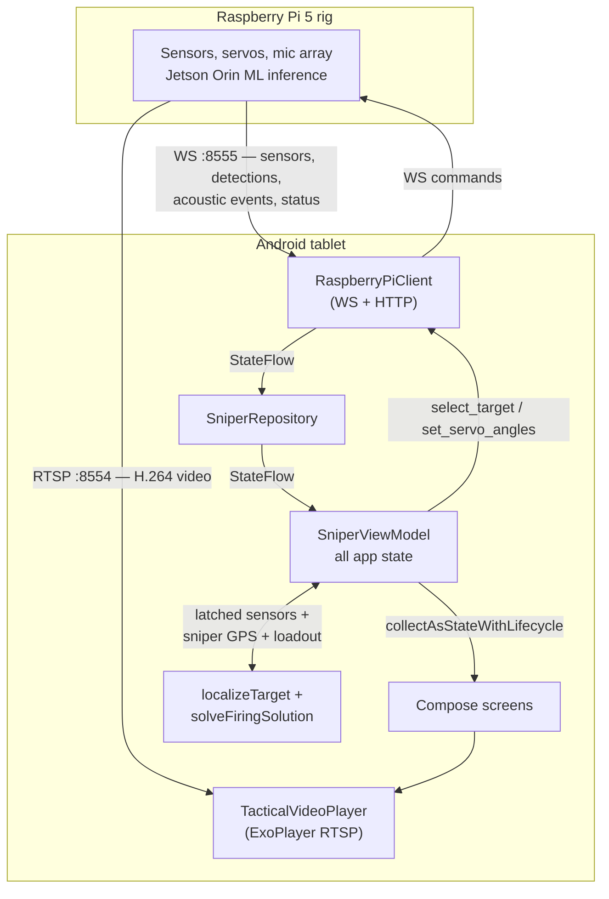

# MySnipeIt

Android operator HUD for a remote **Raspberry Pi 5** sniper/sensor rig.

The tablet is the operator's window onto a rig it is not physically attached to. It renders the Pi's live RTSP video, draws the Pi's ML target detections over it, shows sensor telemetry (rangefinder, temperature/humidity, GPS, wind, servo angles, compass), computes a full ballistic firing solution on-device, raises acoustic-contact alerts from the rig's 4-microphone array, and sends commands back — lock/unlock a target, slew the head toward a gunshot.

> **New here?** Read [Architecture](#architecture) first, then follow the [Guided code tour](#guided-code-tour). Every heading links straight to the file it describes.

---

## Contents

- [At a glance](#at-a-glance)
- [Getting it running](#getting-it-running)
- [Architecture](#architecture)
- [Guided code tour](#guided-code-tour)
  - [1. Entry point and app shell](#1-entry-point-and-app-shell)
  - [2. State — the single ViewModel](#2-state--the-single-viewmodel)
  - [3. Talking to the Pi](#3-talking-to-the-pi)
  - [4. The ballistic calculator](#4-the-ballistic-calculator)
  - [5. Video and the target overlay](#5-video-and-the-target-overlay)
  - [6. The design system](#6-the-design-system)
  - [7. Tests](#7-tests)
- [Design decisions worth defending](#design-decisions-worth-defending)
- [Known limitations](#known-limitations)

---

## At a glance

| | |
|---|---|
| **Platform** | Android, `minSdk 26`, `target/compileSdk 34`, landscape-only, immersive |
| **Language** | Kotlin 2.0.21 |
| **UI** | 100% Jetpack Compose + Material3, custom "tactical" dark/light palette |
| **Architecture** | Single Activity → ViewModel → Repository → Client. State via `StateFlow`. |
| **Target device** | 1280×800 tablet in landscape; phone-landscape degrades via a 840dp breakpoint |
| **Networking** | WebSocket (control) + RTSP (video) + HTTP (unused stub) |
| **Persistence** | `SharedPreferences` only — no Room, no DataStore |
| **Package** | `com.example.mysnipeit` |

Key config: [`app/build.gradle.kts`](app/build.gradle.kts) · [`AndroidManifest.xml`](app/src/main/AndroidManifest.xml) · [`gradle/libs.versions.toml`](gradle/libs.versions.toml)

---

## Getting it running

1. Open in Android Studio (AGP 8.12.1 → Hedgehog or newer).
2. Add a Google Maps key to `local.properties` (gitignored):
   ```
   MAPS_API_KEY=AIza...
   ```
   It is injected into the manifest by the Secrets Gradle plugin.
3. Run on a landscape Android 8.0+ device.

**Without a Pi:** just run it. If the WebSocket connection fails, the app falls back to a built-in mock data generator after a few seconds, and [`MockVideoFeed`](app/src/main/java/com/example/mysnipeit/ui/dashboard/MockVideoFeed.kt) plays a bundled clip in place of the RTSP stream. You can also force this path deliberately from **Diagnostics → MOCK MODE**.

**With a Pi:** join the rig's WiFi AP (`MyHotspot`, gateway `10.42.1.1`) and pick Device 3 from the device list.

```bash
./gradlew :app:testDebugUnitTest    # the pure-math test suites
./gradlew :app:assembleDebug        # build
```

---

## Architecture

One Activity, one ViewModel, one repository, one network client. There is no DI framework and no navigation graph — both were judged unnecessary at this size, and both are called out in [Known limitations](#known-limitations).



The important structural point: **video and control are two independent connections.** A WebSocket blip does not tear down the RTSP stream, and vice versa. This is deliberate and is explained in [Design decisions](#4-video-is-decoupled-from-the-control-channel).

---

## Guided code tour

### 1. Entry point and app shell

**[`MainActivity.kt`](app/src/main/java/com/example/mysnipeit/MainActivity.kt)**

The only Activity in the app. It does four things and then gets out of the way:

- **Immersive mode** (`enableImmersiveMode`) hides the status and navigation bars, and re-hides them in `onWindowFocusChanged` after the user swipes to peek. An operator HUD that gives up a strip of a 1280×800 screen to Android chrome is wasting the screen.
- **Runtime location permission** (`ensureLocationPermission`). If already granted it starts the GPS provider immediately; otherwise it launches the request and starts on the callback. **On denial, `userLocation` stays null forever** — the map hides the marker and the firing solution simply doesn't compute. Nothing crashes and nothing is faked.
- **Theme host** — collects `darkTheme` from the ViewModel and wraps everything in `MySniperItTheme`.
- **`SniperApp`** — the navigation switch (see below).

**Navigation** lives in the same file, in the `SniperApp` composable. There is **no Navigation Compose graph**; it's a `when (uiState.currentScreen)` over the `AppScreen` enum, with `previousScreen` tracked manually so `goBackFromDashboard()` returns to whichever entry path was used (device list *or* map). For five screens this is less machinery than a nav graph and easier to read. It would not survive a sixth or seventh screen.

---

### 2. State — the single ViewModel

**[`SniperViewModel.kt`](app/src/main/java/com/example/mysnipeit/viewmodel/SniperViewModel.kt)** — the largest and most important non-UI file in the app. Everything the UI renders comes out of here as a `StateFlow`.

Three mechanisms in here are worth understanding properly, because they're where the real design thinking is.

#### 2a. Sensor latching — `latchedSensorData`

**The problem:** every sub-frame the Pi sends carries a `valid` flag. When a sensor glitches for one frame, the naive UI snaps that cell to `—` and back. On a dashboard with seven live values, that's a HUD that flickers constantly.

**The fix:** two parallel flows.

- `sensorData` — the **raw** stream, straight from the Pi. Consumed by **Diagnostics**, so the operator can see the actual flag state when debugging.
- `latchedSensorData` — each sub-frame independently holds its last *valid* reading for up to `sensorLatchTimeoutMs` (5 s) before falling back to `—`. Consumed by the **Dashboard**.

Two details that matter:

- **Wind speed and direction latch independently**, because the Pi has two separate valid flags for them — one channel can glitch while the other reads fine.
- **The compass only latches when `heading_deg` is non-null.** The Pi emits a JSON `null` for the heading before the magnetometer fixes, so `CompassFrame.headingDeg` is a `Float?`. A missing heading must never be substituted as `0°`, which would silently mean "due true north."

The latch is driven by two coroutines: one reacts to each new frame (so the UI updates immediately), and one sweeps every 500 ms (so the timeout still fires when the Pi goes silent *or* keeps re-sending the same `valid=false` frame).

#### 2b. The firing solution — `firingSolution`

A reactive `combine()` over five inputs: latched sensors, the sniper's GPS, the sniper's altitude, the selected cartridge, and the selected rifle. Any of them changing recomputes the solution.

`computeFiringSolution` is a two-stage pipeline, and the two stages exist for a specific reason:

```
Pi sensors ──localizeTarget──► target world coords ──solveFiringSolution──► AZ / hold / windage
```

**Why two stages:** the tablet and the rig are at *different physical positions*. The Pi's own bearing and distance to the target are useless to the shooter directly — the solution has to be recomputed from the sniper's GPS toward the target's absolute world position. The intermediate `TargetLocation` is that hand-off.

**The Pi does not compute a firing solution at all** — by design it publishes only the raw sensor data needed to compute one. That split is deliberate and it's the right one: the solution depends on where the *shooter* stands, and the rig has no way of knowing that. `firingSolution` is the only firing solution in the system.

#### 2c. The acoustic alert state machine — `activeAudioAlert`

Raw `acousticEvent` frames are not directly renderable — a gunshot produces a burst of detections, and a naive UI would stack a card per detection. `applyAcousticEvent` turns the raw stream into one derived alert:

| Behaviour | Value | Why |
|---|---|---|
| **Dedupe window** | ±15° | ~2× the typical TDOA error of a 4-mic array at sub-100 m. Two events inside this are the same source — refresh the card in place, don't stack a new one. |
| **Auto-dismiss** | 20 s from *first* detection | Counted from the first event of a group, **not** refreshed on dedupe — otherwise a continuously-firing source would pin its alert on screen forever. |
| **Dismiss debounce** | 30 s | After an explicit DISMISS, the same source is suppressed — so the operator's decision isn't instantly overruled by the next shot. |
| **Interactivity** | `selectedTargetId` | Target locked → passive chip (don't interrupt an engagement). Nothing locked → full card with SLEW/DISMISS. Flips automatically. |

**The critical detail:** dedupe and debounce key on the **raw mic azimuth**, not the world bearing. The raw azimuth is always present regardless of calibration state, so the state machine keeps working when uncalibrated or expired — the alert just displays `REL <angle>` instead of a world bearing, and **SLEW still works**, because slewing only needs the raw azimuth.

UI: [`AudioAlert.kt`](app/src/main/java/com/example/mysnipeit/ui/dashboard/AudioAlert.kt) · model: [`models/AudioAlert.kt`](app/src/main/java/com/example/mysnipeit/data/models/AudioAlert.kt)

---

### 3. Talking to the Pi

#### [`RaspberryPiClient.kt`](app/src/main/java/com/example/mysnipeit/data/network/RaspberryPiClient.kt)

Almost all the integration complexity in the project. **The file has a long JSDoc footer at the bottom with the exact JSON shapes — read it before touching anything here; don't invent shapes.**

**Three ports, three different jobs:**

| Port | Protocol | Purpose | Status |
|---|---|---|---|
| 8555 | WebSocket | Bidirectional control + telemetry | The real channel |
| 8554 | RTSP | H.264 video | Live |
| 8000 | HTTP | `calibrate_system`, `set_manual_target`, `emergency_stop` | **The Pi has no HTTP server** — these are no-ops |

The HTTP path (`sendCommand`) is kept because the API is defined and may be implemented later. Everything that actually needs to work goes over the WebSocket via `sendWsCommand`, with the envelope `{type, command, params, timestamp}`.

**Inbound messages** are dispatched in `handleWebSocketMessage`: `sensor_data`, `target_detection`, `stream_ready`, `system_status`, `acoustic_event`.

**Two background jobs:**

- `startKeepalive()` — a small JSON ping every 20 s. Without it, NAT/router idle timeouts silently kill the connection. Unknown message types fall through harmlessly on the Pi's C server, so this needed no Pi-side change.
- `startStalenessChecker()` — a **link-lost backstop only**. Normal overlay clearing is explicit (see below); this only fires if *no* detection message arrives for 3 s, meaning the link is dead and the operator shouldn't be staring at a frozen box.

#### The detection contract — the Pi owns tracking

This is the single most important thing to understand about detections, and it's worth being able to explain the history.

**The Pi runs a motion-compensated tracker.** The Jetson Orin does stateless per-frame inference; the Pi joins those detections to servo pose, associates them in *world-angle* space so IDs survive camera pans, and coasts tracks through gaps of up to 1.5 s.

**So the app is a pure pass-through display.** There is deliberately **no** app-side tracker, re-ID, smoothing, or coasting. There used to be — and it fought the Pi's tracker, producing visible ID churn on screen. Two trackers disagreeing is worse than one.

The rules that fall out of that:

1. **`id` is a stable Pi track id.** Render it verbatim; send it back verbatim on lock.
2. **`confirmed` gates lockability.** `true` once a track has ≥2 hits — the Pi only locks confirmed tracks. The UI ghosts unconfirmed boxes and shows `UNCONFIRMED` where the LOCK button would be, rather than offering a dead button.
3. **`confirmed` *absent* (parsed as `null`) means the whole message is a fallback/overlay-only frame** carrying raw per-frame Orin ids — nothing in it is lockable. **Detect this by null, not by inspecting id values.**
4. **An empty `detections: []` clears the overlay immediately.** The Pi says "clear all boxes" explicitly; clearing is not a timeout behaviour.
5. **`timestamp_ms` is the Orin's monotonic clock** — not epoch, not comparable to the app's clock. The app never reads it; staleness uses the app's own receive time.

**Why lock works now:** `sendLockCommand` sends the wire id back under *both* `target_id` and `id`. Before this contract, the app displayed its own synthetic `T1`/`T2` ids and sent those — the Pi couldn't match them and fell back to its highest-confidence track, i.e. **it locked the wrong target.** Getting this field name right is what makes lock hit the target the operator actually chose.

#### [`WifiBinder.kt`](app/src/main/java/com/example/mysnipeit/data/network/WifiBinder.kt)

**The problem:** the rig's access point has **no internet upstream**. Android notices this and prefers cellular, so every socket aimed at the Pi gets routed out the mobile network and fails. On a phone with a SIM the app simply cannot reach the rig.

**The fix:** request a network with `TRANSPORT_WIFI` and — crucially — `.removeCapability(NET_CAPABILITY_INTERNET)`, then `bindProcessToNetwork()`. That's the explicit "yes, I know this WiFi has no internet, route me there anyway."

`getGatewayIp()` reads the DHCP gateway and decodes it from a **little-endian 32-bit int** into a dotted IPv4 string, falling back to `10.42.1.1`.

#### [`WifiPerfLock.kt`](app/src/main/java/com/example/mysnipeit/data/network/WifiPerfLock.kt)

**The problem:** Android's client-side WiFi power-save periodically sleeps the radio and batches traffic. Against the Pi's soft-AP and its own buffering, this produced 20–30 s "deaf" windows that froze the video.

**The fix:** hold a `WIFI_MODE_FULL_LOW_LATENCY` WifiLock plus a partial wake lock for the life of the live view. Pi-side traces showed suppressing power-save pushed time-to-freeze from ~1 min to 5+ min. Falls back to the deprecated `WIFI_MODE_FULL_HIGH_PERF` below API 29, since `minSdk` is 26.

#### [`SniperRepository.kt`](app/src/main/java/com/example/mysnipeit/data/repository/SniperRepository.kt)

A thin pass-through over the client — it re-exposes the flows and forwards commands. It earns its place in one spot: `slewToAcousticContact`, which encodes the **slew contract** with the Pi as a single switchable constant, `SLEW_COMMAND_MODE`.

Two options were on the table:

- `SLEW_TO_BEARING` — send a world bearing, let the Pi resolve servo angles with its own freshest compass reading.
- `SET_SERVO_ANGLES` — **the active choice.** The app converts mic azimuth to servo angle directly (`micAzimuth + 90°`, clamped to 0–180) and the Pi just moves the servos.

**Why the second wins:** the mic array and the pan servo are both bolted to the same fixed tripod, so they share a frame separated by one mechanical constant. That conversion involves **no compass at all** — which makes the slew path immune to a stale or missing compass fix, exactly the condition under which you most want a gunshot alert to still work.

**The slew is horizontal-only.** A 4-mic array resolves azimuth, not elevation, so a slew has nothing to say about tilt and must never move it. But `set_servo_angles` carries both axes with no "leave this one alone" encoding — so the app expresses "don't move" by reading the camera's current `vertical_deg` and echoing it straight back.

> This was a real bug. The tilt used to be sent as a hardcoded `SERVO_VERTICAL_LEVEL_DEG` (90° = horizon), so **every slew recentred the camera and discarded the operator's elevation.** The lesson generalises: "we have no elevation information" means *don't command elevation*, not *command it to level*. Level is not a neutral value — it is an assertion, and it overrode the operator every time.

The tilt is validated with `?.takeIf { it in 0.0..180.0 }` — the servo's mechanical travel — falling back to level only when there is genuinely no reading. That range check is honest validation rather than a guess precisely because [`ServoFrame`](app/src/main/java/com/example/mysnipeit/data/models/SensorData.kt)'s angles are nullable (below): null means "no reading", so `0.0` can be trusted as a real full-down aim and held rather than discarded.

#### Data models — [`data/models/`](app/src/main/java/com/example/mysnipeit/data/models)

[`SensorData.kt`](app/src/main/java/com/example/mysnipeit/data/models/SensorData.kt) mirrors the Pi's nested C structs (`ddl_frame` → `distance` / `temperature_humidity` / `servo` / `gps` / `compass` / `wind`). It exposes helper extensions — `distanceM()`, `gpsLatLon()`, `windSpeedMps()`, `compassHeadingDeg()` and friends — that **fold the `valid` check and the null check into the read**. Always use them; never reach into the nested fields directly, or you'll read a stale or invalid value as if it were good.

**Angles that can be absent are typed `Float?`, never defaulted to `0f`.** This applies to `CompassFrame.headingDeg` and to both `ServoFrame` angles, and the reason is the same in each case: **`0` is a legitimate value, not a sentinel.** `0°` on the compass is due true north; `0°` on the tilt servo is the camera aimed straight down. A non-null `0f` default makes "the Pi never sent this field" indistinguishable from a real reading, and every consumer downstream then acts on a number nobody measured.

> `ServoFrame` carried that `0f` default until recently, which is why the slew guard above once had to treat an exact `0.0` as suspicious rather than trusting it. Typing the field honestly removed the need for the heuristic. The same care extends to the latch in `SniperViewModel`: a servo frame is only latched when **both** angles are present, so a partial frame can't displace the last good one and quietly send the slew back to its fallback.

---

### 4. The ballistic calculator

Three pure-function files, no Android dependencies, fully unit-testable. This is the part of the codebase with real test coverage.

#### [`TargetLocalizer.kt`](app/src/main/java/com/example/mysnipeit/data/ballistics/TargetLocalizer.kt)

Turns the rig's sensors into the target's absolute world position, in five steps:

1. Boresight azimuth = compass heading + declination (+ servo pan **only if** the compass is base-mounted).
2. Elevation angle from servo tilt, where 90° = horizon.
3. Split the rangefinder's slant distance: `horizontal = slant·cos(el)`, `vertical = slant·sin(el)`.
4. Project from the Pi's GPS along the azimuth using an **equirectangular (flat-earth) approximation**.
5. Target altitude = Pi altitude + vertical offset.

**On the flat-earth projection:** at the sub-5 km ranges a rangefinder can produce, the error is sub-centimetre. A full Vincenty solution would be complexity with no measurable benefit.

**`RigGeometry`** holds the physical constants. The one to know: **`COMPASS_ON_FIXED_BASE = false`.** The compass is on the moving camera arm, so its reading *is* the camera's pointing direction and servo pan is **not** added on top. Get this backwards and every bearing is wrong by the pan angle.

`localizeTarget` returns **null** if any required input is missing. That's deliberate — the UI shows `—` rather than a solution computed from a substituted zero.

#### [`AcousticBearing.kt`](app/src/main/java/com/example/mysnipeit/data/ballistics/AcousticBearing.kt)

One line of real math — `world = tripodWorldBearing + event.azimuth` — wrapped in the null contract. The `tripodWorldBearing` term is an operator-captured value, not a live compass reading, because the compass sits on the moving camera head while the mic array is on the fixed tripod. The file's own KDoc carries the full reasoning.

#### [`FiringSolutionSolver.kt`](app/src/main/java/com/example/mysnipeit/data/ballistics/FiringSolutionSolver.kt)

The real solver. `solveFiringSolution` runs: sniper→target geometry → atmosphere → sight angle → **numerically bisect on barrel angle** → hold-over → windage.

There is no closed-form solution, so `integrateTrajectory` steps the bullet forward in small time increments against the G1 drag table, and `findBarrelAngle` bisects (25 iterations, ~10⁻⁶ rad) until the trajectory passes through the target.

**Two bugs were found and fixed here. Both are worth being able to explain, because both were silent.**

**Bug 1 — the G1 drag table had the wrong Mach axis.** The old table paired correct Cd values against the wrong Mach numbers, mapping subsonic drag coefficients onto the supersonic range. Drag was under-applied by **up to 34% at 1 km**. It was replaced with a proper 79-point standard G1 (Ingalls) table, Mach 0–5, checked against an independent reference calculator (agreement within 2–4% across Mach 1.0–2.4).

> The giveaway: a test asserted impact velocity at 100 m was in `780..835 m/s`. That range had been fitted to *the solver's own output*, not to an external source — so the test was **documenting the defect instead of catching it.** The reference value is ~763 m/s. Test assertions are now pinned to outside references, which is why a test failing after a table edit is evidence about the table.

**Bug 2 — downhill shots returned plausible, wrong answers without reporting failure.** The bisection used a fixed `[−2°, +28°]` bracket. To hit a target 10° below you, the barrel itself sits near −10° — outside that bracket. The search saturated on its own lower bound and returned a number that *looked* fine: **7.9° of hold-over for a 300 m/10° downhill shot, where the true answer is under 0.5°.** No error, no null, just a wrong number on the HUD.

The fix has two parts, and both are needed:
- The bracket is anchored to the **look angle** (`[lookAngle−2°, lookAngle+28°]`), so the same search width applies whether the shot is level, uphill or downhill.
- The "bullet is gone" floor is relative to the **target** (`targetVertical − 50 m`), not an absolute −50 m from the muzzle. A target 52 m downhill is legitimately reached by passing well below the muzzle's line of sight.

Do not reintroduce a fixed bracket or an absolute floor. The regression tests in [`FiringSolutionSolverTest.kt`](app/src/test/java/com/example/mysnipeit/data/ballistics/FiringSolutionSolverTest.kt) exist to stop exactly that.

Cartridge and rifle presets live in [`BallisticProfiles.kt`](app/src/main/java/com/example/mysnipeit/data/models/BallisticProfiles.kt), picked via [`LoadoutDialog.kt`](app/src/main/java/com/example/mysnipeit/ui/dashboard/LoadoutDialog.kt).

---

### 5. Video and the target overlay

#### [`TacticalVideoPlayer.kt`](app/src/main/java/com/example/mysnipeit/ui/dashboard/TacticalVideoPlayer.kt)

ExoPlayer (Media3) RTSP playback plus every overlay drawn on the video: bounding boxes, info cards, crosshair, scan line.

**The stall watchdog** is the most valuable code in this file. The RTSP session wedges after the soft-AP's periodic WiFi blackouts — frames stop arriving even though the transport recovers — and **ExoPlayer will not self-heal.** The only manual fix was backing out of the screen and reconnecting.

So: a coroutine polls playback position every 500 ms. If the position hasn't advanced for `STALL_TIMEOUT_MS` (3 s) while the player is supposed to be playing, it tears down and rebuilds the RTSP media source — doing programmatically what the operator was doing by hand, and resetting accumulated latency as a bonus. It backs off exponentially so a genuinely dead server isn't hammered, and resets the backoff the moment playback progresses.

That same loop drives the dashboard's **VIDEO** chip via `onVideoHealthChanged`, so the chip reflects *real frame flow* rather than connection state.

**RTSP transport is an operator A/B toggle** (Diagnostics → STREAM, persisted as `rtsp_force_tcp`, default TCP). TCP matches the Pi's `-rtsp_transport tcp` — reliable, but stalls hard on loss. UDP degrades more gracefully on a lossy link but needs the Pi to accept it. Flipping it reloads the stream.

**Bbox rendering and interaction:**

- Bboxes arrive as pixels against a **hardcoded 1920×1080** frame (`VIDEO_WIDTH`/`VIDEO_HEIGHT`). The video region is constrained to 16:9 so those coordinates map correctly on non-16:9 tablets without pillarbox math in every draw call.
- **Double-tap a box to lock/unlock.** The gesture area expands symmetrically to a minimum 48 dp (`MIN_TAP_TARGET`) — a person at 150 m shrinks to a ~30 px box, well under a fingertip — while the **drawn** rectangle stays at the true bbox size, so the display never lies about detection extent.
- Handlers go through `rememberUpdatedState` because `pointerInput` is keyed on `Unit` and would otherwise capture stale closures.
- **The info card is a *sibling* of the bbox, not a child.** As a child it was size-constrained by narrow bboxes and wrapped its text. It measures itself with `onSizeChanged` and stays at `alpha 0` for one frame until that lands.
- **Cards avoid HUD obstructions.** `topOverlayObstruction` / `bottomOverlayObstruction` tell the player how far the parent's bars reach into the video. It subtracts the letterbox slack, then flips the card above the box (or clamps it) so the LOCK button can't end up **visible but not pressable** underneath the sensor strip — which is exactly what happened before.

#### [`DashboardScreen.kt`](app/src/main/java/com/example/mysnipeit/ui/dashboard/DashboardScreen.kt)

The HUD chrome around the video: top bar with LINK/VIDEO chips and the calibration-age chip, target rail, firing-solution card, bottom sensor strip.

The contract to remember: **the sensor strip is drawn *over* the video**, so `SensorStripHeight` is a shared constant passed straight into the player as `bottomOverlayObstruction`. Any new bar that overlays the video needs the same treatment or it will bury interactive elements.

**LINK and VIDEO are two separate chips** on purpose — LINK is WebSocket state, VIDEO is real frame flow. They can legitimately disagree, and when they do, that difference is the diagnosis.

---

### 6. The design system

| File | Role |
|---|---|
| [`Theme.kt`](app/src/main/java/com/example/mysnipeit/ui/theme/Theme.kt) | `MySniperItTheme`; exposes `LocalTactical` + `LocalIsDarkTheme` |
| [`Color.kt`](app/src/main/java/com/example/mysnipeit/ui/theme/Color.kt) | `TacticalDark` + `TacticalLight` palettes |
| [`Type.kt`](app/src/main/java/com/example/mysnipeit/ui/theme/Type.kt) | Inter (body) + JetBrains Mono (HUD/tactical) |
| [`TacticalComponents.kt`](app/src/main/java/com/example/mysnipeit/ui/theme/TacticalComponents.kt) | Shared `TopBar`, `Chip`, `Bracket`, `Lbl`, `Stat`, `ThemeToggle` |
| [`Responsive.kt`](app/src/main/java/com/example/mysnipeit/ui/theme/Responsive.kt) | `isCompactWidth()` / `responsiveDp()` — 840dp breakpoint |

Conventions: start every composable with `val t = LocalTactical.current` and never hardcode a colour. Use `LocalIsDarkTheme` for non-palette decisions, like picking the dark vs light Google Maps JSON.

**One deliberate inconsistency:** `bboxTracked` (orange) and `bboxLocked` (red) are the **same hex in both palettes**. They sit over live video, not over app chrome, so they shouldn't follow the app's theme at all.

Other screens: [`HomeScreen`](app/src/main/java/com/example/mysnipeit/ui/home/HomeScreen.kt) · [`DeviceSelectionScreen`](app/src/main/java/com/example/mysnipeit/ui/device/DeviceSelectionScreen.kt) · [`MapScreen`](app/src/main/java/com/example/mysnipeit/ui/map/MapScreen.kt) · [`DiagnosticsScreen`](app/src/main/java/com/example/mysnipeit/ui/diagnostics/DiagnosticsScreen.kt)

---

### 7. Tests

All real coverage is pure-math, under [`app/src/test/.../data/ballistics/`](app/src/test/java/com/example/mysnipeit/data/ballistics):

| Suite | Covers |
|---|---|
| [`TargetLocalizerTest`](app/src/test/java/com/example/mysnipeit/data/ballistics/TargetLocalizerTest.kt) | Geodesy and rig geometry for the localizer |
| [`FiringSolutionSolverTest`](app/src/test/java/com/example/mysnipeit/data/ballistics/FiringSolutionSolverTest.kt) | Solver, drag table, and the downhill regression cover |
| [`AcousticBearingTest`](app/src/test/java/com/example/mysnipeit/data/ballistics/AcousticBearingTest.kt) | Mic azimuth → world bearing, including the null contract |

The UI, the ViewModel and `RaspberryPiClient` have **no** test coverage.

> **Gotcha:** backtick-quoted JVM test names cannot contain `->` — they fail to compile. Write "gives" instead.

---

## Design decisions worth defending

These are the questions most likely to be asked. Short answers, with the reasoning behind them.

#### 1. Why does the app compute the firing solution when the Pi already sends one?
Because a solution is only meaningful from the shooter's position, and the rig doesn't know where that is. Range, bearing and look angle all differ between the two. So the split of responsibility is: the Pi measures and publishes (rangefinder, compass, servo pose, GPS, atmosphere), and the app computes — localising the target in world coordinates from the rig's readings, then solving from the sniper's own GPS toward it.

#### 2. Why is there no target tracking in the app?
There was, and it was removed. The Pi runs a motion-compensated tracker that associates in world-angle space and coasts through gaps. An app-side tracker on top of that produced two disagreeing trackers and visible ID churn. The app is now a pass-through, which also means the id it displays is the id it sends back on lock — which is what made lock hit the right target.

#### 3. Why calibrate the bearing manually instead of using the compass?
Because the compass is on the moving head and the microphones are on the fixed tripod. Their relationship isn't a mechanical constant — it changes with every pan. Calibration captures the relationship once, when the head is at a known position. It expires after 90 minutes because the operator has probably moved the rig by then.

#### 4. Video is decoupled from the control channel
A WebSocket close no longer clears `rtspStreamUrl` or `streamReady` — only an explicit `disconnect()` does. The player watches `streamReady` alone. On a flaky soft-AP link, control-channel blips are routine, and there's no reason one should black out working video. Hence two chips: **LINK** and **VIDEO**.

#### 5. Why `null` everywhere instead of default values?
Every sensor read that can fail returns null, and every consumer renders `—`. A missing compass heading substituted as `0°` doesn't look like an error — it looks like *due north*, and it silently poisons every downstream bearing. A missing servo tilt substituted as `0°` looks like the camera is aimed at the ground. In both cases `0` is a real, meaningful value, so it can never double as "no data" — which is why those fields are `Float?` rather than defaulted.

This is the same class of failure as the downhill bug: **wrong-but-plausible is more dangerous than visibly missing.** A crash or a `—` gets investigated; a confident wrong number gets acted on.

#### 6. Why WebSocket for commands when there's an HTTP API?
The Pi has no HTTP server — port 8000 isn't listening. The WebSocket is already open and the Pi parses inbound command frames there. The HTTP path is kept as a stub in case a server is added.

#### 7. Why no Hilt, no Navigation Compose, no Room?
Deliberate scope calls at this size: one Activity, one ViewModel, five screens, and no relational data worth a database. All three are listed below as things that would need revisiting if the app grows.

---

## Known limitations

Honest list — these are known, not overlooked.

- **No dependency injection.** Hilt is in the version catalog but not applied. The ViewModel constructs its own repository.
- **No Navigation Compose.** `previousScreen` is manual back-stack tracking. Fine for five screens; replace it before adding many more.
- **Two ExoPlayer generations coexist** — legacy 2.19.1 and Media3 1.2.0. New code should use Media3; the legacy dependency is unused and removable.
- **Version catalog is only partly used.** `app/build.gradle.kts` hardcodes most versions; the catalog carries unused Hilt/serialization entries.
- **Hardcoded video resolution** — 1920×1080. If the Pi changes resolution, bbox scaling breaks.
- **Hardcoded device list** — four fixed entries in the ViewModel. No real device discovery.
- **Strings are inlined.** `strings.xml` has only `app_name`; all UI text is literal in composables. Not translation-ready.
- **No UI, ViewModel or networking tests.**
- **Bbox tweening is stripped** — boxes snap to reported positions so field validation sees the tracker's raw motion. Purely visual tweening (keyed on the wire id, no lifecycle change) can be re-added.
- **`NetworkTester` and `testHttpApi` are unused**, kept for future diagnostic work.
- **Magnetic declination is 0.** Acceptable for the POC (~5°E in the deployment region ≈ 9 m lateral at 100 m); a real deployment would compute it from GPS + date.

---

## Contributing notes

[`CLAUDE.md`](CLAUDE.md) is the deep-detail engineering reference — exact wire formats, gotchas, and invariants. **Keep it updated in the same commit as any change it describes.** This README is the orientation layer; `CLAUDE.md` is the manual.
