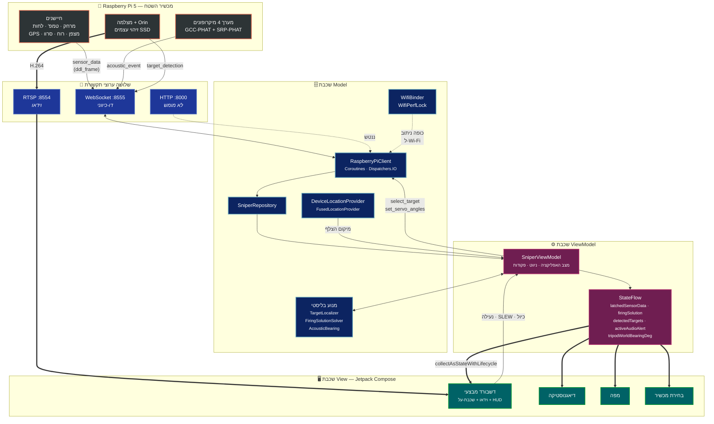
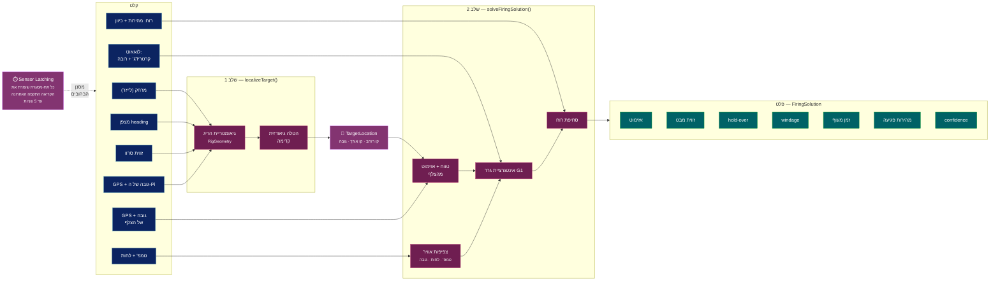
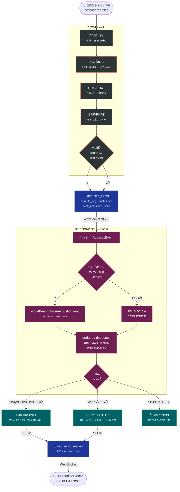

# תרשימי ארכיטקטורה — אפליקציית MySnipeIt

טיוטת תרשימים לפרק 11. שלושה תרשימים, כל אחד ממוקד בשאלה אחרת.
מסומנים בשמות ה-placeholders שישולבו בטקסט הפרק.

---

## `[FIG: app-mvvm-layers]` — שכבות MVVM וזרימת המידע

התרשים המרכזי לסעיף 11.2.1. מראה את שלוש השכבות, את שלושת ערוצי התקשורת,
ואת נקודת ההפרדה שבה החישוב הבליסטי מתבצע באפליקציה ולא ב-Pi.

---

## `[FIG: ballistic-pipeline]` — צינור החישוב הבליסטי הדו-שלבי

לסעיף 11.2.3. הנקודה ההנדסית: הצלף וה-Pi נמצאים במיקומים פיזיים שונים,
ולכן אי אפשר להשתמש ישירות במרחק ובכיוון שה-Pi מדד.

---

## `[FIG: acoustic-alert-flow]` — זרימת ההתראה האקוסטית מקצה לקצה

לסעיף 11.2.4. מראה את שתי דרכי הפעולה: כיוון עולמי כשהכיול תקף,
וזווית יחסית כשאינו — ובשני המקרים ה-SLEW עובד, כי הוא תלוי רק
באזימוט הגולמי.

---

## הערות

1. התרשימים ב-Mermaid כדי שיהיו ניתנים לעריכה. להטמעה ב-Word — לייצא ל-PNG/SVG
   דרך [mermaid.live](https://mermaid.live) ולהדביק.
2. תרשים 1 מיועד להשלים את איור 8.1 (תרשים הארכיטקטורה הכללי) בזום פנימה
   על האפליקציה בלבד — לא להחליף אותו.
3. ערוץ ה-HTTP מסומן מקווקו ומסומן "ננטש" בכוונה — זו החלטה מתועדת
   ברשומת פיתוח 11.1.1, לא השמטה.
